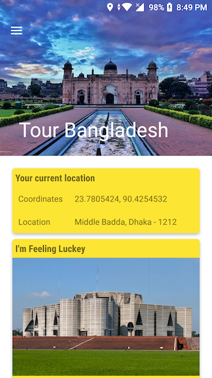
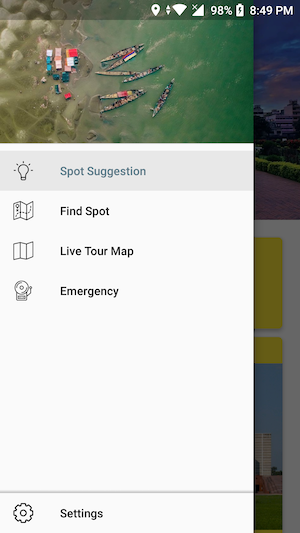
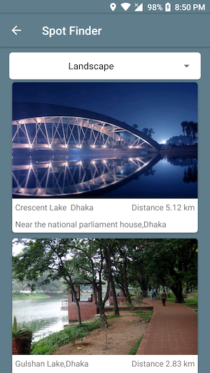
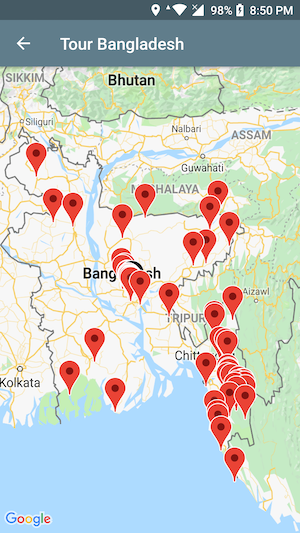
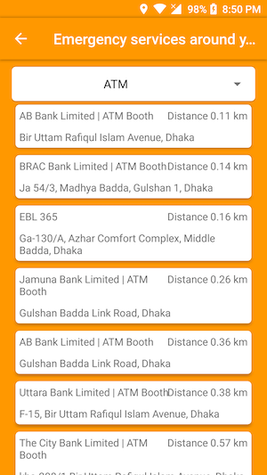

# Tour Bangladesh
Tour Bangladesh is a smart tourism application for Bangladesh. By using this application user can find the beautiful place based on their current location. This application will provide some information about the place, show the routes and the distance between the spot and the user. Tour Bangladesh uses mobile GPS and geolocation based on mobile IP address to locate the user current position.

### Screenshots

  

  